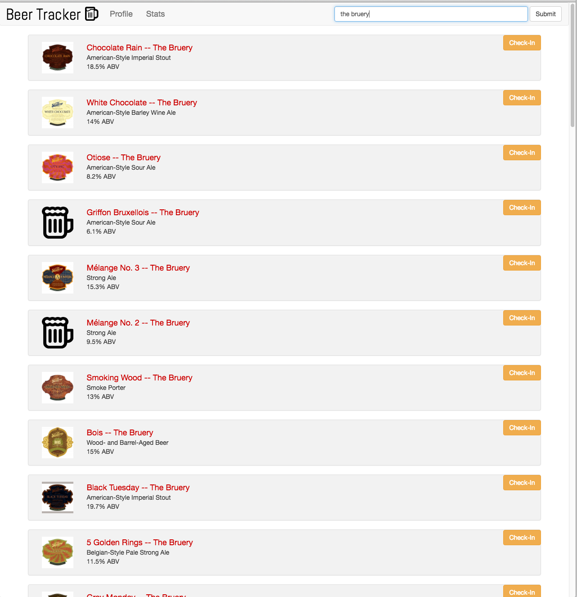
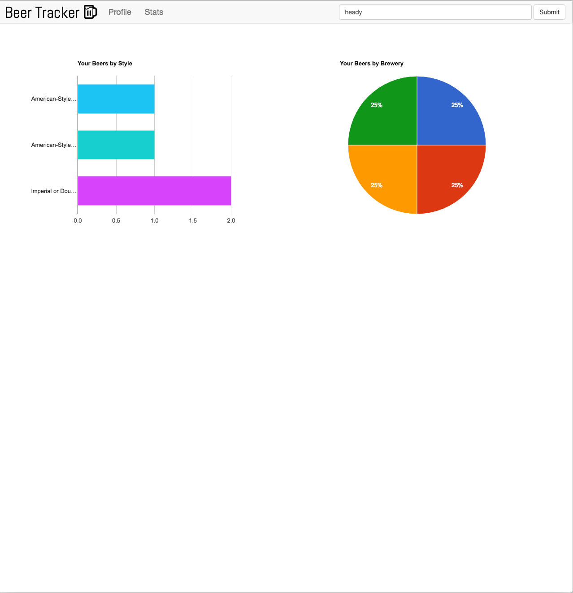

# Beer-Tracker
A tracking app for craft-beer enthusiasts who want to chronicle a journey through the vast world of beer.

[Check out Beer-Tracker on Heroku!](https://m-rstewart-beer-tracker.herokuapp.com/)

Frameworks:
* Node.js
* Express.js
* MongoDB

Libraries:
* jQuery
* Underscore.js
* Bootstrap 3

API's:
* BreweryDB
* Google Charts

With Beer-Tracker, a user can search through a large database of beers and check in the beers they've had.

Previous check-ins can be viewed on the user's profile page:

Check-ins can also be viewed graphically by style and by brewery:

If a user cannot find a beer, it can be added manually:

